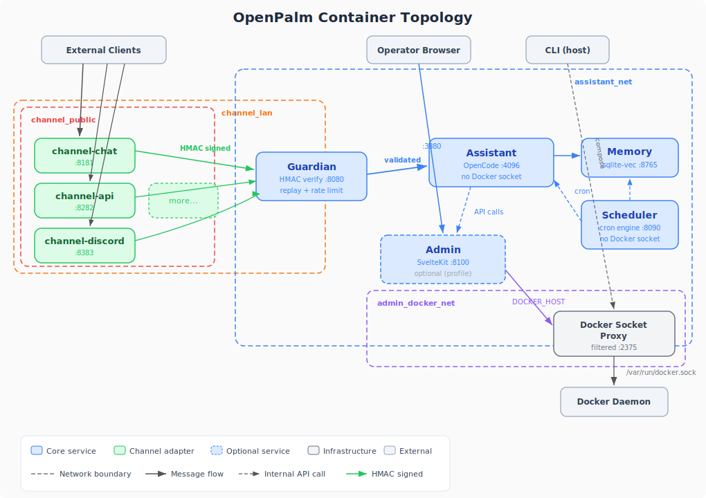

<p>
  <strong>A foundation for building your own AI assistant - private, extensible, and yours to keep.</strong>
</p>

---

## You deserve your own assistant

AI assistants should not be someone else's product. They should be something you own, shape, and trust. OpenPalm is a starter kit for that: a self-hosted foundation you can run on your own hardware, inspect as plain files, and extend without fighting hidden orchestration.

## What makes the core strong

- **Defense in depth** - Every message passes through HMAC-signed verification, replay detection, and rate limiting before reaching the assistant. The assistant has no Docker socket and no host access beyond its mounts.
- **Manual-first stack** - The live stack is just Docker Compose files under `~/.openpalm/stack/`. You can inspect them, run them directly, and enable addons with normal Compose flags.
- **Working asset bundle** - The repo ships a `.openpalm/` bundle that seeds the installed home. It provides the source assets for the registry catalog, the core compose file, env schemas, defaults, and helper scripts.
- **Optional tooling** - Raw `docker compose` is the source of truth. Setup scripts and future tooling are convenience layers on top.
- **Memory that persists** - Data stays on the host under `~/.openpalm/` for backup, restore, and direct editing.

## Extend it with integrations

OpenPalm is built to integrate, not lock you in.

### Varlock - secret protection at every layer

[Varlock](https://varlock.dev) is an open-source secret management and redaction tool integrated throughout the stack:

- **Validation** - Environment files are checked against schemas before the stack starts.
- **Leak scanning** - Pre-commit hooks and CLI commands can catch accidentally committed keys.
- **Runtime redaction** - Assistant bash output can be filtered before secrets enter the model context.

If Varlock is not installed, OpenPalm still runs. You just lose that extra protection layer.

### AKM - agent knowledge management

[AKM](https://github.com/itlackey/akm) extends the assistant with structured knowledge capabilities. It installs alongside OpenPalm's assistant tools and can be customized by adding your own knowledge, skills, and tools to the stash directory.

### Bring your own everything

- **Models** - Connect any OpenAI-compatible endpoint, local or remote.
- **Channels** - Start with built-in addons like chat, API, Discord, Slack, or voice.
- **Tools and skills** - The assistant runs on OpenCode, so OpenCode plugins work naturally.
- **Automations** - Add recurring tasks by editing files in `~/.openpalm/config/automations/`.

## Get started

You need Docker with Compose V2.

| Your computer | What to install | Link |
|---|---|---|
| **Windows** | Docker Desktop | [docker.com/products/docker-desktop](https://www.docker.com/products/docker-desktop/) |
| **Mac** | Docker Desktop or OrbStack | [docker.com/products/docker-desktop](https://www.docker.com/products/docker-desktop/) / [orbstack.dev](https://orbstack.dev/download) |
| **Linux** | Docker Engine | Run `curl -fsSL https://get.docker.com | sh` |

Then use the manual-first flow after `~/.openpalm/` has been installed or seeded:

```bash
git clone https://github.com/itlackey/openpalm.git
cp -R "$HOME/.openpalm/registry/addons/admin" "$HOME/.openpalm/stack/addons/admin"
cp -R "$HOME/.openpalm/registry/addons/chat" "$HOME/.openpalm/stack/addons/chat"
$EDITOR "$HOME/.openpalm/vault/stack/stack.env"
$EDITOR "$HOME/.openpalm/vault/user/user.env"
cd "$HOME/.openpalm/stack"
docker compose \
  -f core.compose.yml \
  -f addons/admin/compose.yml \
  -f addons/chat/compose.yml \
  --env-file ../vault/stack/stack.env \
  --env-file ../vault/user/user.env \
  up -d
```

That example enables `admin` and `chat` by copying them from the runtime catalog at `~/.openpalm/registry/addons/` into the enabled runtime overlays at `~/.openpalm/stack/addons/`, then starts the core stack plus those overlays. Review the env files before first boot, then change the copied addon directories and `-f addons/<name>/compose.yml` list to choose a different stack. Multiple instances remain a manual-only pattern.

`config/stack.yml` is capabilities only. It is not addon state and it is not the deployment truth. The running stack is always the compose file set you pass to Docker Compose.

See the [setup guide](docs/setup-guide.md) for the convenience path.

## How it works

<div>

<p>OpenPalm keeps the live system understandable: host-owned files define the stack, guardian protects ingress, and the assistant stays isolated from Docker and the broader host.</p>
</div>



| Component | Role |
|---|---|
| **Admin** (`packages/admin/`) | Optional SvelteKit UI + API for operators and assistant-driven management. |
| **Guardian** (`core/guardian/`) | Bun HTTP server for HMAC verification, replay detection, and rate limiting. |
| **Assistant** (`core/assistant/`) | OpenCode runtime with tools and skills, isolated from Docker. |
| **Channel runtime** (`core/channel/`) | Unified image entrypoint for addon-backed channel containers. |
| **Channel packages** (`packages/channel-*/`) | Adapters that translate external protocols into signed guardian messages. |
| **Channels SDK** (`packages/channels-sdk/`) | Shared crypto, logger, payload types, and base classes for adapters. |

**Architectural invariants:**
- The host-side compose command is authoritative.
- The guardian is the sole ingress for channel traffic.
- The assistant has no Docker socket and limited mounts.
- LAN-first defaults stay in place unless you opt into broader exposure.

See [`docs/how-it-works.md`](docs/how-it-works.md) for the full walkthrough and [`docs/technical/core-principles.md`](docs/technical/core-principles.md) for security invariants.

## Make it yours

- **Add an addon** - Copy it from the catalog at `~/.openpalm/registry/addons/<name>/` into `~/.openpalm/stack/addons/<name>/`, then include its compose file.
- **Add assistant tools** - Put OpenCode assets under `~/.openpalm/config/assistant/`.
- **Customize memory** - Edit the memory defaults and provider secrets in the copied bundle.
- **Schedule automations** - Add YAML files under `~/.openpalm/config/automations/`.
- **Swap models** - Change values in `~/.openpalm/vault/user/user.env`.

## Documentation

| Guide | What's inside |
|---|---|
| [Setup Guide](docs/setup-guide.md) | Manual-first install, convenience tooling, updates, and troubleshooting |
| [How It Works](docs/how-it-works.md) | Architecture overview and data flow |
| [Managing OpenPalm](docs/managing-openpalm.md) | Configuration, addons, secrets, access control |
| [Core Principles](docs/technical/core-principles.md) | Security invariants and architectural rules |
| [Community Channels](docs/channels/community-channels.md) | Building custom adapters |
| [API Spec](docs/technical/api-spec.md) | Admin API endpoint contract |

### Component READMEs

| Component | README |
|---|---|
| Stack (compose, addons) | [.openpalm/stack/README.md](.openpalm/stack/README.md) |
| Vault (env schemas, examples) | [.openpalm/vault/README.md](.openpalm/vault/README.md) |
| Admin (UI + API) | [packages/admin/README.md](packages/admin/README.md) |
| Guardian | [core/guardian/README.md](core/guardian/README.md) |
| Assistant | [core/assistant/README.md](core/assistant/README.md) |
| Channel runtime | [core/channel/README.md](core/channel/README.md) |
| Channels SDK | [packages/channels-sdk/README.md](packages/channels-sdk/README.md) |
| Assistant tools | [packages/assistant-tools/README.md](packages/assistant-tools/README.md) |
| CLI | [packages/cli/README.md](packages/cli/README.md) |
| Channel: API | [packages/channel-api/README.md](packages/channel-api/README.md) |
| Channel: Discord | [packages/channel-discord/README.md](packages/channel-discord/README.md) |
| Scripts | [scripts/README.md](scripts/README.md) |
| Docs index | [docs/README.md](docs/README.md) |

## License

See [MPL-2.0](LICENSE).
