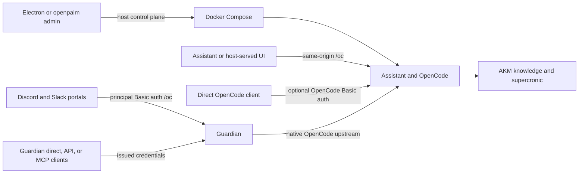

# OpenPalm

<p>
  <strong>Your own AI assistant. Private, self-hosted, no hype required.</strong>
</p>

---

## What is this?

OpenPalm is two things: a **harness** and a **stack**.

**The harness** runs on your machine — either as a CLI binary or an Electron desktop app. It manages a single directory (`~/.openpalm/`) that contains plain files you can read and edit:

- Docker Compose files and addon overlays
- Environment files for non-secret stack config and [AKM](https://github.com/itlackey/akm) (the assistant's persistent memory and knowledge-stash layer) user variables
- Private principal (an authenticated identity Guardian issues credentials to — a portal, bot, or direct client), service, and provider credential files
- OpenCode configuration (model, providers, persona)
- AKM configuration (memory, embeddings, knowledge stash)
- Voice and portal configuration

The harness job is unglamorous: download Docker images, place the right content in the right files, and start `docker compose up`. That's the entire control plane. If you prefer, you can skip the harness entirely and manage those files by hand.

**The stack** is what the harness runs. At its core:

- An **OpenCode assistant** in Docker — your AI, talking to whatever model you point it at, with persistent memory and skills via AKM
- A **Guardian** — the profile-gated front door for portals and Guardian clients, enforcing principal authentication, ownership checks, rate limits, and default-on fail-closed content validation
- Optional **addons** — portal adapters such as Discord and Slack, services such as Voice, or anything you add through Compose

Official clients are the Electron desktop app and the OpenPalm UI — the same SvelteKit app, served as a co-process inside the assistant container. The assistant-served and host-served OpenPalm UIs have direct paths to OpenCode; portals and Guardian direct/API clients reach it through Guardian.

---

OpenPalm started as a hobby project — a weekend experiment to see if a useful AI assistant could be built on boring, standard tools. Turns out it can. It's now a daily driver, and it keeps getting better.

No proprietary orchestration layer, no magic runtime, no lock-in. Just containers, env files, and compose overlays. If you can run `docker compose up`, you can run OpenPalm.

## Where things stand

Use the [latest published release](https://github.com/itlackey/openpalm/releases/latest). See the [changelog](CHANGELOG.md) for current work and release-specific upgrade notes.

See the download table below. The `access.*` setup-spec fields (`networkAccess`,
`assistantDirect`, `guardianNetwork`, `guardianOpenaiApi`) require `0.13.0` or
newer; see [Setup Guide](docs/setup-guide.md#headless-setup).

## What you get

- **An AI assistant that's yours** — Runs on [OpenCode](https://opencode.ai), talks to any OpenAI-compatible model (local or remote), and remembers things between sessions.
- **Portals** — Talk to your assistant through an OpenAI-compatible API, Discord, Slack, or build your own adapter.
- **Security by default** — Portal and Guardian ingress traffic passes through principal authentication, ownership checks, and rate limits. Direct Assistant access is loopback-only by default, and the Assistant has no Docker socket.
- **Plain control plane** — Stack and control-plane state use Compose, env, and configuration files. Service runtime data, including SQLite databases, stays under `~/.openpalm/data/`.
- **LAN-first** — Nothing is exposed to the internet unless you explicitly choose to expose it.

## Get started

**1. Install Docker (with Compose V2)** — OpenPalm runs your assistant in Docker containers.

| Platform | Get Docker |
|---|---|
| **Mac** | [Docker Desktop](https://www.docker.com/products/docker-desktop/) or [OrbStack](https://orbstack.dev/download) |
| **Windows** | [Docker Desktop](https://www.docker.com/products/docker-desktop/) |
| **Linux** | [Docker Engine](https://docs.docker.com/engine/install/) (`curl -fsSL https://get.docker.com \| sh`) |

**2. Download the OpenPalm desktop app** — Recommended for most users.

Grab the file matching your platform from the
[releases page](https://github.com/itlackey/openpalm/releases). Filenames are
versioned — `<version>` below stands for the release tag (e.g.
`0.13.0`) — so link to the releases page, not to a specific file URL.

| Platform | Filename | Run |
|---|---|---|
| **Mac (Apple Silicon)** | `OpenPalm-<version>-arm64-mac.zip` | Unzip → drag **OpenPalm.app** to Applications |
| **Mac (Intel)** | `OpenPalm-<version>-mac.zip` | Unzip → drag **OpenPalm.app** to Applications |
| **Windows (portable)** | `OpenPalm-<version>-win.zip` | Unzip → run **OpenPalm.exe**. No install step, but no auto-update either. |
| **Windows (installer)** | `OpenPalm-Setup-<version>.exe` | Run it to install per-user (no admin prompt); updates itself in place afterward. |
| **Linux (x64)** | `OpenPalm-<version>.AppImage` | `chmod +x` → run |
| **Linux (arm64)** | `OpenPalm-<version>-arm64.AppImage` | `chmod +x` → run |

> **Mac Intel has no arch marker in its filename.** `OpenPalm-<version>-mac.zip`
> (no `-x64-` or `-arm64-`) is the Intel build; only the Apple Silicon build
> says `-arm64-`. Picking the file that "looks" more specific gets you the
> wrong architecture.
>
> **Windows: pick one.** The portable zip needs no install but never
> auto-updates; the installer replaces itself on new releases but writes to
> `%LOCALAPPDATA%`. See
> [Desktop app updates](docs/managing-openpalm.md#desktop-app-updates) for the
> full auto-update matrix.
>
> **Linux AppImage needs `libfuse2`**, which Ubuntu 22.04+, Debian 12+, and
> Fedora no longer install by default. Without it the AppImage fails with
> `dlopen(): error loading libfuse.so.2` before OpenPalm starts. Install it
> **before** launching the AppImage:
>
> ```sh
> # Ubuntu / Debian 12 and earlier
> sudo apt update && sudo apt install -y libfuse2
>
> # Debian 13 (trixie) and newer — the 64-bit time_t transition renamed the
> # package to libfuse2t64
> sudo apt update && sudo apt install -y libfuse2t64
> ```
>
> On other distros, install the equivalent `fuse2`/`libfuse2` package. If you
> can't install libfuse2, run
> `./OpenPalm-<version>.AppImage --appimage-extract-and-run` instead.

Open the app, follow the setup wizard (it'll confirm Docker is running, ask which AI provider to use, and start the stack), and land directly on the chat page. Done.

> First launch on macOS/Windows: builds are not code-signed, so there's a
> one-time security prompt. On macOS 15 (Sequoia) and newer, right-click →
> Open no longer bypasses this for unsigned apps — instead, try to open the
> app once (it will be blocked), then go to **System Settings → Privacy &
> Security**, scroll to the block notice, and click **Open Anyway**, then
> confirm **Open** in the follow-up dialog. On older macOS versions,
> right-click **OpenPalm.app → Open** still works. Either way, you can instead
> clear the quarantine flag before first launch: `xattr -dr
> com.apple.quarantine OpenPalm.app`. On Windows, click **More info → Run
> anyway** on the SmartScreen prompt. Subsequent launches are unrestricted.

<details>
<summary><strong>Command-line install</strong></summary>

For power users who prefer a CLI:

```bash
curl -fsSL https://raw.githubusercontent.com/itlackey/openpalm/main/scripts/setup.sh | bash
```

This downloads the CLI binary for your platform, seeds `~/.openpalm/`, and
opens the same setup wizard in a browser — at
`http://127.0.0.1:3880/setup`, loopback-only, on purpose. **This is not
headless**: on an SSH-only server there's no local browser to open it in. Tunnel
the port over SSH instead, then open the URL on your side of the tunnel:

```bash
ssh -L 3880:127.0.0.1:3880 user@host
```

For a genuinely headless install with no browser step, write a setup spec and
run:

```bash
openpalm install --file <path-to-setup-spec.yaml>
```

See the [setup guide](docs/setup-guide.md) for the full headless flow, the
setup-spec format, and the bare-metal `docker compose` path.

</details>

## Make it yours

- **Swap models** — Point it at OpenAI, Anthropic, Groq, Ollama, LMStudio, or anything OpenAI-compatible.
- **Add portals** — Enable Discord, Slack, or the OpenAI-compatible API by enabling the relevant addon in your stack.
- **Extend the assistant** — Drop in OpenCode plugins, custom tools, or let the assistant find what they need with built-in [AKM](https://github.com/itlackey/akm) support.
- **Schedule automations** — Add YAML files to run recurring tasks on a cron schedule.
- **Protect your secrets** — The shared control-plane logger redacts structured values under recognized sensitive key names; this is not a blanket guarantee for every service log. `openpalm scan` inventories discovered sensitive keys and secret files as set or empty without printing their values.

## How it works


```mermaid
flowchart LR
  Admin[Electron or openpalm admin] -->|host control plane| Compose[Docker Compose]
  Compose --> Assistant[Assistant and OpenCode]
  UI[Assistant or host-served UI] -->|same-origin /oc| Assistant
  Direct[Direct OpenCode client] -->|optional OpenCode Basic auth| Assistant
  Portals[Discord and Slack portals] -->|principal Basic auth /oc| Guardian
  Clients[Guardian direct, API, or MCP clients] -->|issued credentials| Guardian
  Guardian -->|native OpenCode upstream| Assistant
  Assistant --> AKM[AKM knowledge and supercronic]
```

Guardian mediates portal and Guardian-facing protocols. It is not inserted into the supported direct Assistant or UI paths.

For the full walkthrough, see [How It Works](docs/how-it-works.md). For security invariants and architectural rules, see [Core Principles](docs/technical/core-principles.md).

## Documentation

| Guide | What's inside |
|---|---|
| [Setup Guide](docs/setup-guide.md) | Install, update, and troubleshoot |
| [How It Works](docs/how-it-works.md) | Architecture and data flow |
| [Managing OpenPalm](docs/managing-openpalm.md) | Config, addons, secrets, automations |
| [Core Principles](docs/technical/core-principles.md) | Security invariants and design rules |
| [Community Portals](docs/portals/community-portals.md) | Build your own guardian-facing portal adapter |
| [Upgrade 0.12.x → 0.13.0](docs/operations/upgrade-0.12-to-0.13.md) | `private/` folds into `state/`, and the OpenCode password becomes mandatory |
| [Upgrade 0.10.x → 0.11.0](docs/operations/upgrade-0.10-to-0.11.md) | Historical: migrating a pre-0.11 install |
| [Full docs index](docs/README.md) | Everything else |

## Contributing

OpenPalm is open source under [MPL-2.0](LICENSE). Contributions are welcome — just know that things move fast right now and the architecture is still settling. Check out the [docs index](docs/README.md) to get oriented, and don't hesitate to open an issue if something breaks or doesn't make sense.
