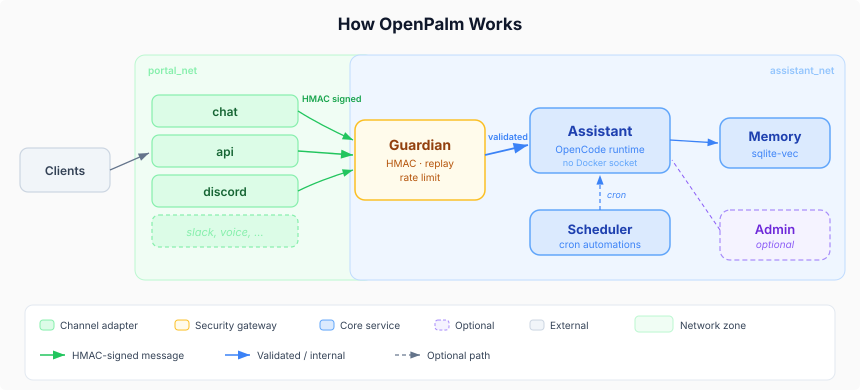

<p>
  <strong>Your own AI assistant. Private, self-hosted, no hype required.</strong>
</p>

---

## What is this?

OpenPalm is two things: a **harness** and a **stack**.

**The harness** runs on your machine — either as a CLI binary or an Electron desktop app. It manages a single directory (`~/.openpalm/`) that contains plain files you can read and edit:

- Docker Compose files and addon overlays
- Environment variable files (system config, principal secret files, user API keys)
- OpenCode configuration (model, providers, persona)
- AKM configuration (memory, embeddings, knowledge stash)
- Voice and channel configuration

The harness job is unglamorous: download Docker images, place the right content in the right files, and start `docker compose up`. That's the entire control plane. If you prefer, you can skip the harness entirely and manage those files by hand.

**The stack** is what the harness runs. At its core:

- An **OpenCode assistant** in Docker — your AI, talking to whatever model you point it at, with persistent memory and skills via AKM
- A **Guardian** — the only way in from the outside, enforcing principal-authenticated ingress, ownership checks, and rate limiting on every request, with optional fail-closed content validation (heuristic screen + local OpenCode moderator) when enabled
- Optional **portal containers** — Discord, Slack, voice chat, or anything you build — each one just a compose overlay

Official clients are the Electron desktop app and the OpenCode web interface (served directly by the assistant container). Everything else reaches the assistant through a portal/direct-ingress → guardian pipeline.

---

OpenPalm started as a hobby project — a weekend experiment to see if a useful AI assistant could be built on boring, standard tools. Turns out it can. It's now a daily driver, and it keeps getting better.

No proprietary orchestration layer, no magic runtime, no lock-in. Just containers, env files, and compose overlays. If you can run `docker compose up`, you can run OpenPalm.

## Where things stand

**0.11.0** is a refactor and simplification release. The architecture is stable — assistant, guardian, portal/direct ingress, and the AKM memory/skills layer all work and are in daily use. This release consolidates the stack layout, removes a lot of incidental complexity, and ships the revised setup wizard.

**0.12.x** will focus on stabilization and hardening: install/upgrade lifecycle robustness, better error recovery, and closing the remaining rough edges before v1.

If you're running OpenPalm today, 0.11.0 is the release to be on. If you need production stability guarantees, watch for 0.12.x.


## What you get

- **An AI assistant that's yours** — Runs on [OpenCode](https://opencode.ai), talks to any OpenAI-compatible model (local or remote), and remembers things between sessions.
- **Portals** — Talk to your assistant through a web chat, an API, Discord, Slack, or build your own adapter.
- **Security by default** — Every ingress request passes through guardian principal authentication, ownership checks, and rate limiting before it reaches the assistant. The assistant itself has no Docker socket access.
- **Plain files all the way down** — The stack is Docker Compose files. Config is env files. Addons are compose overlays. No database for state, no hidden config, nothing you can't `cat`.
- **LAN-first** — Nothing is exposed to the internet unless you explicitly choose to expose it.

## Get started

**1. Install Docker (with Compose V2)** — OpenPalm runs your assistant in Docker containers.

| Platform | Get Docker |
|---|---|
| **Mac** | [Docker Desktop](https://www.docker.com/products/docker-desktop/) or [OrbStack](https://orbstack.dev/download) |
| **Windows** | [Docker Desktop](https://www.docker.com/products/docker-desktop/) |
| **Linux** | [Docker Engine](https://docs.docker.com/engine/install/) (`curl -fsSL https://get.docker.com \| sh`) |

**2. Download the OpenPalm desktop app** — Recommended for most users.

| Platform | Download | Run |
|---|---|---|
| **Mac (Apple Silicon)** | [OpenPalm‑arm64‑mac.zip](https://github.com/itlackey/openpalm/releases/latest) | Unzip → drag **OpenPalm.app** to Applications |
| **Mac (Intel)** | [OpenPalm‑x64‑mac.zip](https://github.com/itlackey/openpalm/releases/latest) | Unzip → drag **OpenPalm.app** to Applications |
| **Windows** | [OpenPalm‑win.zip](https://github.com/itlackey/openpalm/releases/latest) | Unzip → run **OpenPalm.exe** (portable, no install) |
| **Linux** | [OpenPalm.AppImage](https://github.com/itlackey/openpalm/releases/latest) | `chmod +x` → run |

Open the app, follow the setup wizard (it'll confirm Docker is running, ask which AI provider to use, and start the stack), and land directly on the chat page. Done.

> First launch on macOS/Windows: builds are not code-signed, so there's a one-time security prompt. On macOS, **right-click OpenPalm.app → Open** the first time (or `xattr -dr com.apple.quarantine OpenPalm.app`). On Windows, click **More info → Run anyway** on the SmartScreen prompt. Subsequent launches are unrestricted.

<details>
<summary><strong>Advanced / headless install (CLI)</strong></summary>

For servers or power users who prefer a CLI:

```bash
curl -fsSL https://raw.githubusercontent.com/itlackey/openpalm/main/scripts/setup.sh | bash
```

This downloads the CLI binary for your platform, seeds `~/.openpalm/`, opens the same wizard in your browser, and starts the stack. See the [setup guide](docs/setup-guide.md) for the full headless flow and the bare-metal `docker compose` path.

</details>

## Make it yours

- **Swap models** — Point it at OpenAI, Anthropic, Groq, Ollama, LMStudio, or anything OpenAI-compatible.
- **Add portals** — Enable Discord, Slack, API, or web chat by enabling the relevant addon in your stack.
- **Extend the assistant** — Drop in OpenCode plugins, custom tools, or let the assistant find what they need with built-in [AKM](https://github.com/itlackey/akm) support.
- **Schedule automations** — Add YAML files to run recurring tasks on a cron schedule.
- **Protect your secrets** — Built-in log redactor masks token/secret/key/password/HMAC values from every service log; `openpalm scan` lists which sensitive slots are populated in your env files.

## How it works

<div>

<p>Clients talk to portals or guardian-hosted ingress surfaces. Portals authenticate to the guardian, the guardian validates and forwards to the assistant, and the assistant does the work. That's it.</p>
</div>



For the full walkthrough, see [How It Works](docs/how-it-works.md). For security invariants and architectural rules, see [Core Principles](docs/technical/core-principles.md).

## Documentation

| Guide | What's inside |
|---|---|
| [Setup Guide](docs/setup-guide.md) | Install, update, and troubleshoot |
| [Upgrade 0.10.x → 0.11.0](docs/operations/upgrade-0.10-to-0.11.md) | Upgrade an existing install: file/env/port migration |
| [How It Works](docs/how-it-works.md) | Architecture and data flow |
| [Managing OpenPalm](docs/managing-openpalm.md) | Config, addons, secrets, automations |
| [Core Principles](docs/technical/core-principles.md) | Security invariants and design rules |
| [Community Channels](docs/channels/community-channels.md) | Build your own guardian-facing portal adapter |
| [Full docs index](docs/README.md) | Everything else |

## Contributing

OpenPalm is open source under [MPL-2.0](LICENSE). Contributions are welcome — just know that things move fast right now and the architecture is still settling. Check out the [docs index](docs/README.md) to get oriented, and don't hesitate to open an issue if something breaks or doesn't make sense.
