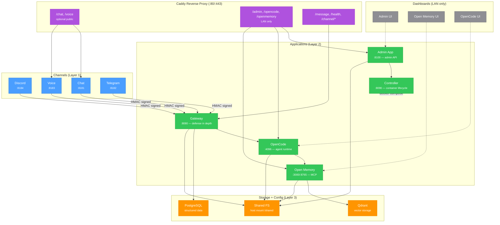

# OpenPalm Architecture — Container / App / Channel

This document describes the three-layer container architecture for OpenPalm.

## Diagram



## Container inventory

Every box in the architecture is a distinct Docker container, except **Shared FS** which is a shared mount point on the host.

| Container | Image | Network | Purpose |
|---|---|---|---|
| `caddy` | `caddy:2-alpine` | assistant_net | Reverse proxy, URL routing, LAN restriction |
| `postgres` | `postgres:16-alpine` | assistant_net | Structured data storage |
| `qdrant` | `qdrant/qdrant:latest` | assistant_net | Vector storage for embeddings |
| `openmemory` | `skpassegna/openmemory-mcp:latest` | assistant_net | Long-term memory (MCP server) |
| `opencode` | `./opencode` (build) | assistant_net | Agent runtime, LLM orchestration |
| `gateway` | `./gateway` (build) | assistant_net | Channel processing, tool firewall, audit |
| `admin-app` | `./admin-app` (build) | assistant_net | Admin API for all management functions |
| `controller` | `./controller` (build) | assistant_net | Container up/down/restart via Docker socket |
| `channel-chat` | `./channels/chat` (build) | assistant_net | HTTP chat adapter (profile: channels) |
| `channel-discord` | `./channels/discord` (build) | assistant_net | Discord adapter (profile: channels) |
| `channel-voice` | `./channels/voice` (build) | assistant_net | Voice/STT adapter (profile: channels) |
| `channel-telegram` | `./channels/telegram` (build) | assistant_net | Telegram adapter (profile: channels) |

## Data flow

### Message processing (channel inbound)
```
User -> Channel Adapter -> [HMAC sign + nonce] -> Gateway -> OpenCode -> Open Memory -> Response
```

All channels are processed through the gateway as defense in depth. The gateway verifies HMAC signatures, checks replay protection, applies rate limiting, runs the tool firewall, and logs audit events.

### Admin operations
```
Admin (LAN) -> Caddy (/admin/*) -> Admin App -> Controller -> Docker Compose
```

The admin app provides the API for all admin functions:
- Add/remove containers via the controller
- Edit Caddy configuration to map sub-urls to containers
- Manage extensions, config, and change bundles

### URL routing via Caddy

| URL Path | Target | Access |
|---|---|---|
| `/chat` | channel-chat:8181 | Optional public |
| `/voice` | channel-voice:8183 | Optional public |
| `/admin/*` | admin-app:8100 | LAN only |
| `/opencode/*` | opencode:4096 | LAN only |
| `/openmemory/*` | openmemory:3000 | LAN only |
| `/message` | gateway:8080 | Via Caddy |
| `/health` | gateway:8080 | Via Caddy |
| `/channel/*` | gateway:8080 | Via Caddy |

### Storage

| Store | Used by | Purpose |
|---|---|---|
| PostgreSQL | Gateway | Structured data, sessions |
| Qdrant | Open Memory | Vector embeddings for memory search |
| Shared FS (`/shared`) | OpenCode, Open Memory, Admin App, Gateway | Shared file storage across services |

## Security model

1. **Caddy** enforces LAN-only access for admin and dashboard URLs
2. **Gateway** is the single entry point for all channel traffic (defense in depth)
3. **HMAC signatures** + nonce/timestamp verify channel adapter identity and prevent replay
4. **Tool firewall** classifies and gates tool usage (safe/medium/high risk tiers)
5. **Admin step-up auth** required for destructive operations
6. **Controller** has the Docker socket — no other service needs it
7. **Rate limiting** at gateway message ingress (120 req/min per user)
8. **Secret detection** blocks memory writes containing sensitive data
