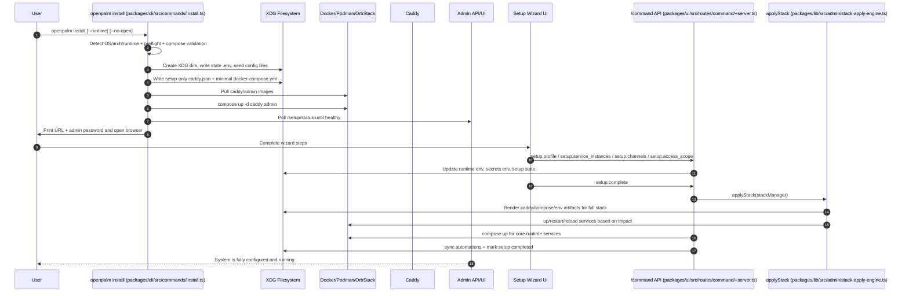

# OpenPalm CLI Documentation

## Overview

OpenPalm is a Bun-compiled command-line tool for managing the OpenPalm platform. The CLI provides commands for installation, service management, updates, and extension handling.

All installer logic is centralized in the CLI binary. The shell scripts (`install.sh` and `install.ps1`) are thin wrappers that download the pre-compiled CLI and delegate to `openpalm install`.

**Package Information:**
- npm package name: `openpalm`
- Version: 0.3.4
- Runtime requirement: Bun >= 1.2.0

## Installation

OpenPalm can be installed using one of four methods:

### 1. Bash (Linux/macOS)

```bash
curl -fsSL https://raw.githubusercontent.com/itlackey/openpalm/main/install.sh | bash
```

This downloads the `openpalm` CLI binary to `~/.local/bin/` and runs `openpalm install`.

### 2. PowerShell (Windows)

```powershell
pwsh -ExecutionPolicy Bypass -Command "iwr https://raw.githubusercontent.com/itlackey/openpalm/main/install.ps1 -OutFile $env:TEMP/openpalm-install.ps1; & $env:TEMP/openpalm-install.ps1"
```

This downloads the `openpalm` CLI binary to `%LOCALAPPDATA%\OpenPalm\` (automatically added to PATH) and runs `openpalm install`.

### 3. npx (Node.js)

```bash
npx openpalm install
```

### 4. bunx (Bun)

```bash
bunx openpalm install
```

## Commands

### `install`

Install and start OpenPalm with a 2-phase installation process.

```bash
openpalm install [options]
```

**Options:**
- `--runtime <docker|podman|orbstack>` - Specify container runtime (auto-detected if not provided)
- `--no-open` - Skip opening browser after installation

**Pre-flight Checks:**

Before starting, the installer automatically checks:
- Disk space (warns if less than 3 GB available)
- Port 80 availability (required for the web interface)
- Container daemon status (detects Docker/Podman installed but not running)

**Installation Phases:**

1. **Phase 1: Setup**
   - Run pre-flight checks
   - Detect container runtime (with actionable guidance if missing)
   - Generate `.env` file with secure tokens
   - Display admin password prominently
   - Create XDG directory tree
   - Seed configuration files (embedded templates — no network download)
   - Reset setup wizard state
   - Write minimal Caddy JSON config for setup-only mode

2. **Phase 2: Early UI Access**
   - Pull and start core services (Caddy, Admin)
   - Wait for admin health check
   - Open browser to setup wizard (unless `--no-open`)
   - The setup wizard completion step applies the full stack and starts core runtime services (Assistant, Gateway, OpenMemory, Postgres, Qdrant, etc.)

### Install + Setup End-to-End Sequence (Detailed)



### Install + Setup Step Report (line-by-line flow)

The steps below map directly to the execution order implemented in `packages/cli/src/commands/install.ts` and the setup API handlers used by the wizard.

#### A) CLI install flow (`packages/cli/src/commands/install.ts`)

| Step | Code area | Files touched | Actions taken |
|---|---|---|---|
| 1 | OS detection | none | Detect host OS; abort on unknown OS |
| 2 | Arch detection | none | Detect CPU architecture (used for image tag suffix) |
| 3 | Runtime detection | none | Resolve runtime from `--runtime` or auto-detect |
| 4 | Compose command resolution | none | Resolve compose bin + subcommand |
| 5 | Preflight checks | none | Check daemon reachability, disk space, port 80; print warnings |
| 6 | Runtime validation | none | Verify compose command actually works; abort with guidance if not |
| 7 | Environment summary | none | Print detected OS/arch/runtime details |
| 8 | XDG path resolution | none | Resolve and print DATA/CONFIG/STATE paths |
| 9 | Idempotency guard | `STATE/docker-compose.yml` (read) | If existing compose appears to be full stack, prompt before overwrite |
| 10 | Directory tree creation | XDG tree under data/config/state | Create required XDG directory structure |
| 11 | Canonical env initialization | `STATE/.env` (and optionally CWD `.env` read/copy source) | Generate secure tokens or reuse existing env, then write canonical env |
| 12 | Admin token hardening | `STATE/.env` | Regenerate admin token if missing or insecure default |
| 13 | Runtime/env upsert | `STATE/.env` | Persist XDG paths, runtime socket/config, image namespace/tag, UID/GID, enabled channels |
| 14 | Convenience env copy | CWD `.env` | Copy canonical state env to working directory |
| 15 | Seed config templates | `CONFIG/**` | Seed embedded configuration templates |
| 16 | Reset setup state | `DATA/admin/setup-state.json` | Remove prior wizard completion state |
| 17 | Uninstall helper script | `STATE/uninstall.sh` | Write uninstall wrapper script and chmod where supported |
| 18 | system env bootstrap | `STATE/system.env` | Ensure admin `env_file` target exists before first full stack apply |
| 19 | Setup-only Caddy config | `STATE/caddy.json`, `STATE/caddy-fallback.json` | Write reverse-proxy config routing setup traffic to Admin |
| 20 | Minimal compose bootstrap | `STATE/docker-compose.yml`, `STATE/docker-compose-fallback.yml` | Write bootstrap compose containing `caddy` + `admin` only |
| 21 | Pull bootstrap images | none (runtime side effects) | Pull caddy/admin images with error guidance on failure |
| 22 | Start bootstrap services | none (runtime side effects) | `compose up -d caddy admin` |
| 23 | Health wait loop | none | Poll `http://localhost/setup/status` with timeout/backoff |
| 24 | Browser open | none | Open setup URL unless `--no-open` |
| 25 | Final UX output | none | Print next steps, troubleshooting, and operational commands |

#### B) Wizard/API setup flow (`packages/ui/src/routes/command/+server.ts`)

All setup commands enforce: unauthenticated setup access is allowed only while setup is incomplete **and** request is local/private.

| Step | Command/API path | Files touched | Actions taken |
|---|---|---|---|
| 1 | `setup.profile` | Data env + setup state | Persist profile name/email and update setup state |
| 2 | `setup.service_instances` | Runtime env + secrets env + setup state + OpenCode config | Persist OpenMemory URLs and provider keys; optionally apply small-model config |
| 3 | `setup.start_core` | Runtime side effects | Pull/start initial runtime services (`postgres`, `qdrant`, `openmemory`, `openmemory-ui`, `assistant`, `gateway`) and restart caddy |
| 4 | `setup.channels` | Runtime env + stack spec + setup state | Persist enabled channels (`OPENPALM_ENABLED_CHANNELS`) and channel-specific config |
| 5 | `setup.access_scope` | Runtime env + stack state + runtime side effects | Set host/lan/public binding scope and bring up caddy (and key services when already completed) |
| 6 | `setup.step` | setup state | Mark wizard step completion checkpoints (`welcome`, `profile`, `serviceInstances`, etc.) |
| 7 | `setup.complete` | Stack artifacts + runtime services + setup state | Apply stack artifacts, start core runtime services, sync automations, and mark setup complete |

#### C) Setup completion internals (`packages/lib/src/admin/stack-apply-engine.ts`)

`setup.complete` delegates to `applyStack(...)`, which performs:

1. Render desired artifacts from current stack spec.
2. Validate referenced secrets.
3. Validate compose configuration.
4. Compute impact (services to `up`, `restart`, `reload`) by diffing existing vs generated artifacts.
5. Write artifacts and execute compose operations in order.
6. On failure, attempt rollback; if rollback fails, fallback to `admin` + `caddy` recovery compose.

This is the reliability boundary that turns wizard inputs into a running full stack.

### `uninstall`

Stop and remove OpenPalm services and data.

```bash
openpalm uninstall [options]
```

**Options:**
- `--runtime <docker|podman|orbstack>` - Specify container runtime
- `--remove-all` - Remove all data and configurations
- `--remove-images` - Remove downloaded container images
- `--yes` - Skip confirmation prompts

### `update`

Pull latest container images and recreate containers with new versions.

```bash
openpalm update
```

### `start`

Start OpenPalm services. Optionally specify individual services to start.

```bash
openpalm start [service...]
```

**Examples:**
```bash
openpalm start              # Start all services
openpalm start caddy        # Start only Caddy service
openpalm start admin api    # Start Admin and API services
```

### `stop`

Stop OpenPalm services. Optionally specify individual services to stop.

```bash
openpalm stop [service...]
```

**Examples:**
```bash
openpalm stop               # Stop all services
openpalm stop postgres      # Stop only PostgreSQL service
openpalm stop admin api     # Stop Admin and API services
```

### `restart`

Restart OpenPalm services. Optionally specify individual services to restart.

```bash
openpalm restart [service...]
```

**Examples:**
```bash
openpalm restart            # Restart all services
openpalm restart admin # Restart only Admin service
```

### `logs`

View container logs with real-time following (tail 50 lines).

```bash
openpalm logs [service...]
```

**Examples:**
```bash
openpalm logs               # View logs from all services
openpalm logs admin         # View logs from Admin service
openpalm logs caddy api     # View logs from Caddy and API services
```

### `status`

Show the status of all OpenPalm containers.

```bash
openpalm status
openpalm ps                 # Alias
```

### `service`

Domain-based service lifecycle command. Uses local compose execution by default, and switches to admin API mode when admin URL/token env vars are configured.

```bash
openpalm service <up|stop|restart|logs|update|status> [service...]
```

**Examples:**
```bash
openpalm service restart assistant
openpalm service logs gateway --tail 200
openpalm service status
```

### `channel`

Domain-based channel management command.

```bash
openpalm channel <add|configure> [options]
```

**Examples:**
```bash
openpalm channel add /path/to/channel.yaml
openpalm channel add "discord:\n  image: ghcr.io/example/channel:latest"
openpalm channel configure discord --exposure lan
```

### `automation`

Domain-based automation execution command.

```bash
openpalm automation <run|trigger> <automation-id>
```

### `extensions`

Manage OpenPalm extensions and plugins.

```bash
openpalm extensions <subcommand> [options]
openpalm ext <subcommand> [options]  # Alias
```

**Subcommands:**

#### `extensions install`

Install an extension by plugin ID.

```bash
openpalm extensions install --plugin <id>
```

#### `extensions uninstall`

Uninstall an extension by plugin ID.

```bash
openpalm extensions uninstall --plugin <id>
```

#### `extensions list`

List all installed extensions.

```bash
openpalm extensions list
```

### `dev preflight`

Validate local development prerequisites (`.env` and `.dev/` directory tree).

```bash
openpalm dev preflight
```

### `dev create-channel`

Scaffold a new channel adapter in `channels/<name>/`.

```bash
openpalm dev create-channel <channel-name> [--port <number>]
```

**Examples:**
```bash
openpalm dev create-channel slack
openpalm dev create-channel matrix --port 8195
```

### `version`

Print the OpenPalm CLI version.

```bash
openpalm version
openpalm --version
openpalm -v
```

### `help`

Show help information.

```bash
openpalm help
openpalm --help
openpalm -h
```

## Global Flags

The following flags are available for all commands:

- `--version`, `-v` - Print version information
- `--help`, `-h` - Show help information

## Configuration

OpenPalm uses XDG Base Directory specification for storing data and configuration:

- **Data Directory:** `~/.local/share/openpalm/` (or `$OPENPALM_DATA_HOME`)
- **Config Directory:** `~/.config/openpalm/` (or `$OPENPALM_CONFIG_HOME`)
- **State Directory:** `~/.local/state/openpalm/` (or `$OPENPALM_STATE_HOME`)

These directories can be customized by setting the corresponding environment variables.

## Admin API mode variables

- `OPENPALM_ADMIN_API_URL` (preferred), `ADMIN_APP_URL`, `GATEWAY_URL`
- `OPENPALM_ADMIN_TOKEN` (preferred), `ADMIN_TOKEN`
- `OPENPALM_ADMIN_TIMEOUT_MS` (default: `15000`)
- `OPENPALM_ALLOW_INSECURE_ADMIN_HTTP=1` (only when explicitly needed)

CLI also reads `${OPENPALM_STATE_HOME}/assistant/.env` as a fallback for admin URL/token values.

## Container Runtimes

OpenPalm supports three container runtimes:

- **Docker** - Cross-platform container runtime
- **Podman** - Daemonless container runtime
- **OrbStack** - macOS-only lightweight container runtime

**Auto-detection Order:**
1. OrbStack (macOS only)
2. Docker
3. Podman

The runtime can be explicitly specified using the `--runtime` flag on commands that support it.

## Building from Source

OpenPalm can be built from source using Bun:

### Basic Build

```bash
bun build packages/cli/src/main.ts --compile --outfile dist/openpalm
```

### Cross-Platform Builds

Build for specific platforms using the `--target` flag:

**Linux x64:**
```bash
bun build packages/cli/src/main.ts --compile --target=bun-linux-x64 --outfile dist/openpalm-linux-x64
```

**Linux ARM64:**
```bash
bun build packages/cli/src/main.ts --compile --target=bun-linux-arm64 --outfile dist/openpalm-linux-arm64
```

**macOS x64 (Intel):**
```bash
bun build packages/cli/src/main.ts --compile --target=bun-darwin-x64 --outfile dist/openpalm-darwin-x64
```

**macOS ARM64 (Apple Silicon):**
```bash
bun build packages/cli/src/main.ts --compile --target=bun-darwin-arm64 --outfile dist/openpalm-darwin-arm64
```

**Windows x64:**
```bash
bun build packages/cli/src/main.ts --compile --target=bun-windows-x64 --outfile dist/openpalm-windows-x64.exe
```

**Windows ARM64:**
```bash
bun build packages/cli/src/main.ts --compile --target=bun-windows-arm64 --outfile dist/openpalm-windows-arm64.exe
```

## Support

For issues, questions, or contributions, please visit the OpenPalm GitHub repository.
