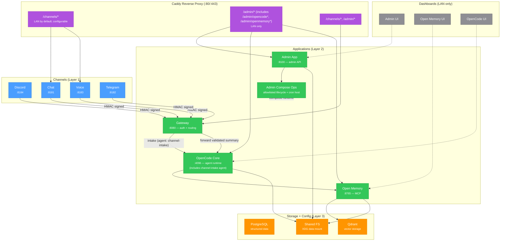

# OpenPalm Architecture — Container / App / Channel

This document describes the container architecture for OpenPalm.

## Diagram



## Container inventory

Every box in the architecture is a distinct container, except **Shared FS** which is a shared mount point on the host.

| Container | Image | Network | Purpose |
|---|---|---|---|
| `caddy` | `caddy:2-alpine` | assistant_net | Reverse proxy, URL routing, LAN restriction |
| `postgres` | `postgres:16-alpine` | assistant_net | Structured data storage |
| `qdrant` | `qdrant/qdrant:latest` | assistant_net | Vector storage for embeddings |
| `openmemory` | `mem0/openmemory-mcp:latest` | assistant_net | Long-term memory (HTTP API + optional MCP server) |
| `openmemory-ui` | `mem0/openmemory-ui:latest` | assistant_net | OpenMemory dashboard (Next.js, port 3000) |
| `opencode-core` | `./opencode` (build) | assistant_net | Agent runtime — extensions (skills, commands, agents, tools, plugins) are baked into the image from `opencode/extensions/`; host config provides optional overrides |
| `gateway` | `./gateway` (build) | assistant_net | Channel auth, rate limiting, runtime routing, audit |
| `admin` | `./admin` (build) | assistant_net | Admin API, stack apply executor (allowlisted compose ops), and automation cron host |
| `channel-chat` | `./channels/chat` (build) | assistant_net | HTTP chat adapter (profile: channels) |
| `channel-discord` | `./channels/discord` (build) | assistant_net | Discord adapter (profile: channels) |
| `channel-voice` | `./channels/voice` (build) | assistant_net | Voice/STT adapter (profile: channels) |
| `channel-telegram` | `./channels/telegram` (build) | assistant_net | Telegram adapter (profile: channels) |

Channel containers are optional at install time. During the setup wizard, users pick which channels to enable, and only those selected channel containers are started/pulled.

## Data flow

### Message processing (channel inbound)
```
User -> Channel Adapter -> Gateway -> AI Assistant -> Gateway -> Channel Adapter -> User
```

More specifically, the inbound path through the gateway is:
```
User -> Channel Adapter -> [HMAC sign] -> Gateway (/channel/inbound) -> OpenCode Core (channel-intake agent: validate/summarize)
  -> Gateway -> OpenCode Core (default agent: full processing) -> Open Memory -> Response -> Gateway -> Channel Adapter -> User
```

The gateway endpoint is `/channel/inbound`. It receives HMAC-signed payloads from channel adapters and processes them through a 6-step pipeline:

1. **HMAC signature verification** — Validates the channel adapter's HMAC signature. Rejects unsigned or tampered requests.
2. **Payload validation** — Validates the structure and content of the incoming payload before further processing.
3. **Rate limiting** — Enforces a limit of 120 requests/min/user. Excess requests are rejected with 429.
4. **Intake validation** — Gateway forwards the message to `opencode-core` using the `channel-intake` agent, which validates and summarizes the input. The `channel-intake` agent runs with deny-by-default permissions (all tools denied). If the intake is rejected, the gateway returns a 422 error.
5. **Forward to assistant** — If the intake is valid, the gateway forwards only the validated summary to `opencode-core` (default agent) for full processing with approval gates.
6. **Audit log** — All inbound requests and their outcomes are written to the audit log.

The gateway is stateless. It verifies HMAC signatures, applies rate limiting (120 req/min/user), logs audit events, and routes traffic to the OpenCode runtime.

This approach uses OpenCode's built-in agent permission model for isolation — the `channel-intake` agent has all tools denied, while the default agent uses approval gates — without requiring a separate container or runtime process.

The `channel-intake` agent is defined in a standalone Markdown file at `gateway/opencode/agents/channel-intake.md` with frontmatter that disables all tools (`"*": false`). The gateway invokes this agent by passing `agent: "channel-intake"` as a parameter to the OpenCode client (see `gateway/src/server.ts:57`). OpenCode loads the agent definition from the `agents/` directory in its config path, applying the frontmatter settings (tool restrictions, description) and the prompt body (which references the `channel-intake` skill and `AGENTS.md`).

### Admin operations
```
Admin (LAN) -> Caddy (/admin/*) -> Admin App -> Compose Runtime
```

The admin app provides the API for all admin functions:
- Add/remove containers via the admin
- Edit Caddy configuration to map sub-urls to containers
- Manage extensions and config

### URL routing via Caddy

| URL Path | Target | Rewritten To | Access |
|---|---|---|---|
| `/channels/chat*` | channel-chat:8181 | `/chat` | LAN by default (public toggle via Admin API) |
| `/channels/voice*` | channel-voice:8183 | `/voice/transcription` | LAN by default (public toggle via Admin API) |
| `/channels/discord*` | channel-discord:8184 | `/discord/webhook` | LAN by default (public toggle via Admin API) |
| `/channels/telegram*` | channel-telegram:8182 | `/telegram/webhook` | LAN by default (public toggle via Admin API) |
| `/admin/api*` | admin:8100 | prefix stripped to `/admin/*` | LAN only |
| `/admin/opencode*` | opencode-core:4096 | prefix stripped to `/*` | LAN only |
| `/admin/openmemory*` | openmemory-ui:3000 | prefix stripped to `/*` | LAN only |
| `/admin*` (catch-all) | admin:8100 | `/admin` prefix stripped before proxy | LAN only |
| `/*` (default route) | opencode-core:4096 | pass-through | LAN only |

Channel access defaults to LAN-only (`abort @not_lan` in Caddyfile). The Admin API can rewrite channel blocks to remove the LAN restriction, making them publicly accessible.

Caddy runtime configuration is mounted from rendered state paths (`${OPENPALM_STATE_HOME}/rendered/caddy/Caddyfile` and `${OPENPALM_STATE_HOME}/rendered/caddy/snippets/`).

During first-boot setup, users can choose `host` vs `lan` scope. `host` scope rewrites Caddy LAN matchers to localhost-only and sets compose bind addresses to `127.0.0.1` for ingress and exposed service ports.

### Storage

Host directories follow the [XDG Base Directory Specification](https://specifications.freedesktop.org/basedir-spec/latest/) with three categories:

| Category | Host Path | Env Var | Contents |
|---|---|---|---|
| **Data** | `~/.local/share/openpalm/` | `OPENPALM_DATA_HOME` | PostgreSQL, Qdrant, Open Memory, Shared FS, Caddy TLS, Admin App |
| **Config** | `~/.config/openpalm/` | `OPENPALM_CONFIG_HOME` | Agent configs (opencode-core/), Caddyfile, channel env files, user overrides, secrets |
| **State** | `~/.local/state/openpalm/` | `OPENPALM_STATE_HOME` | Runtime state, audit logs, compose artifacts (workdir is ~/openpalm) |

### Extension directory layout

Extensions (skills, commands, agents, tools, plugins) are **baked into container images** at build time. `lib/` is a shared library directory used internally and is not an extension sub-type. The canonical sources are `opencode/extensions/` (core) and `gateway/opencode/` (gateway). Host config provides optional user overrides that are volume-mounted at runtime and take precedence over the built-in extensions.

**Extension sub-types and directory layout:**

| Sub-type | Directory convention | Example path |
|---|---|---|
| Skill | `skills/<name>/` | `skills/memory/SKILL.md` |
| Command | `commands/` | `commands/<name>.md` |
| Agent | `agents/` | `agents/<name>.md` |
| Custom Tool | `tools/` | `tools/<name>.ts` |
| Plugin | `plugins/` | `plugins/<name>.ts` |

Directory names are **plural** by convention.

| Source Directory | Container | Contents |
|---|---|---|
| `opencode/extensions/` | opencode-core (baked in) | Full agent config: opencode.jsonc, AGENTS.md, plugins/, lib/, tools/, commands/, skills/memory/ |
| `gateway/opencode/` | gateway (baked in) | Intake agent config: opencode.jsonc, AGENTS.md, agent/channel-intake.md, skills/channel-intake/ |

| Store | Used by | Purpose |
|---|---|---|
| PostgreSQL | Admin App | Structured data |
| Qdrant | Open Memory | Vector embeddings for memory search |

### Secrets

Secrets are key/value credentials for external services stored in `secrets.env`.

- **Storage**: Defined in `secrets.env` (at `$OPENPALM_CONFIG_HOME/secrets.env`), managed via the admin API.
- **Env var naming**: Secret keys are standard uppercase env names (e.g. `OPENAI_API_KEY`) referenced by channel config in Stack Spec.
- **Config interpolation**: Extensions reference secrets in `opencode.json` using `{env:VAR_NAME}` syntax, which is resolved at runtime.
- **Validation**: During stack render/apply, channel config values that reference `${SECRET_NAME}` tokens are validated against the secret inventory; missing keys fail validation.

### Automations

Automations are user-defined scheduled prompts, distinct from the admin's system-level maintenance cron jobs. They allow users to configure proactive assistant behavior (e.g. daily summaries, nightly data pulls) without writing code.

- **Properties**: Each automation has an ID (UUID), Name, Prompt (the text sent to the assistant), Schedule (standard Unix cron expression), and Status (enabled/disabled).
- **Implementation**: Automations run inside `admin` via a cron daemon (`cron && bun run src/server.ts`). Jobs call gateway/admin endpoints or local scripts under `/work`.
- **Payload storage**: Automation payloads are stored as JSON files in `cron-payloads/` (under `$OPENPALM_CONFIG_HOME/cron/`).
- **Session isolation**: Each automation run executes in its own session, identified as `cron-<job-id>`, so runs do not bleed context into each other.
- **Manual trigger**: Automations can be triggered immediately via a "Run Now" action in the admin UI, independent of the schedule.
- **Reactive vs proactive**: Channels are _reactive_ — they respond to user-initiated messages. Automations are _proactive_ — they initiate assistant activity on a schedule.


## Security model

See [Security Guide](../security.md) for the full defense-in-depth security model.

## Single source of truth map

| Concern | Source of truth | Notes |
|---|---|---|
| User intent for stack behavior | `config/stack-spec.json` via `packages/lib/admin/stack-spec.ts` | Keep this file intent-only (no derived runtime state). |
| Secret values and key inventory | `config/secrets.env` via `StackManager` secret APIs | UI should always use live secret inventory from API. |
| Rendered compose/caddy/env artifacts | `packages/lib/admin/stack-generator.ts` output | Generated under `state/rendered/*`; never hand-edit. |
| Compose service allowlist | `packages/lib/admin/compose-runner.ts` | Direct service ops and stack apply share this allowlist. |
| Admin transport routes | `admin/src/server.ts` | Prefer delegating business rules to `packages/lib/admin/*`. |
| Security/routing ingress | `gateway/src/server.ts` and `gateway/src/channel-*` | Gateway remains the only inbound message path. |
| API contract documentation | `docs/development/api-reference.md` | Update this doc when route behavior or payloads change. |
